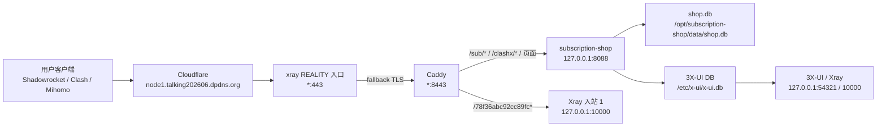

# Node1 项目维护交接文档

> 文档用途：让新的维护人员快速接手 `Node1` 订阅服务、3X-UI/Xray 节点、Caddy/Cloudflare 反代、用户订阅发放和常见故障处理。
>
> 最新更新：2026-06-29

## 1. 当前结论

- 现有交接文档就是本文件。原文件只覆盖 2026-06-13 的初始部署，已经补充为维护总入口。
- 当前生产节点域名：`node1.talking202606.dpdns.org`。
- 当前服务器：`66.94.122.149`。
- 当前对外架构：`Cloudflare -> xray(443, REALITY fallback) -> Caddy(8443) -> subscription-shop / XHTTP inbound`。
- 当前用户订阅服务：`subscription-shop`，运行在服务器本地 `127.0.0.1:8088`。
- 当前管理后台服务：`subscription-shop-admin`，运行在服务器本地 `127.0.0.1:8089`，入口域名 `admin.talking202606.dpdns.org`。
- 当前主订阅入站：`id=1`，备注 `VLESS-XHTTP-TLS-CF`，监听 `127.0.0.1:10000`。
- 当前兼容旁路入站：`id=3`，备注 `VLESS-XHTTP-TLS-CF-STREAM-UP`，监听 `127.0.0.1:10003`，只给 jack/nanaleer 这类 `packet-up` 失败用户发放。
- 当前 jack 专用兼容入站：`id=4`，备注 `VLESS-WS-TLS-CF-JACK`，监听 `127.0.0.1:10004`，用于 XHTTP 到达 Xray 但手机端仍无法正常出网的场景。
- 兼容入站：`id=2` / `VLESS-node1-direct-REALITY` 仍启用，用于旧配置过渡；不要再给新用户发放。
- 2026-06-29 已重新切回 `XHTTP + Cloudflare` 发放：`subscription-shop` 现在输出 `node1.talking202606.dpdns.org:443 + type=xhttp`，并已把共享用户的 `client_traffics` 归位到入站 1。

## 2. 架构图



## 3. 关键机器和路径

服务器登录：

```bash
ssh -i ~/.ssh/node1_vnc_ed25519 root@66.94.122.149
```

如果本机 Shadowrocket 正在接管路由，普通 SSH 可能被隧道干扰。可以绑定本机物理网卡 IP：

```bash
ssh -b <本机局域网IP> -i ~/.ssh/node1_vnc_ed25519 root@66.94.122.149
```

生产关键路径：

| 类型 | 路径 |
|---|---|
| 订阅服务代码 | `/opt/subscription-shop/app.py` |
| 订阅服务环境变量 | `/etc/subscription-shop.env` |
| 管理后台环境变量 | `/etc/subscription-shop-admin.env` |
| 订阅服务数据库 | `/opt/subscription-shop/data/shop.db` |
| 3X-UI 数据库 | `/etc/x-ui/x-ui.db` |
| Caddy 宿主机配置 | `/opt/talking202605/cloud-deploy/caddy/Caddyfile` |
| Caddy 容器内配置 | `/etc/caddy/Caddyfile`，只读挂载 |
| 本地开发文件 | `/Volumes/littlejiang02/Swallow_network/app.py.affiliates` |
| 本地测试文件 | `/Volumes/littlejiang02/Swallow_network/test_affiliate_accounting.py` |

凭据说明：

- 不在文档中保存 3X-UI 管理员密码、用户 UUID、订阅 token、API key。
- 需要登录 3X-UI 时，优先通过服务器上的受控密钥/密文记录或既有运维凭据管理方式获取。
- 如果必须临时传递凭据，走一对一安全通道，不写入仓库和交接文档。

## 4. 当前生产配置

`/etc/subscription-shop.env` 必须保持以下关键值：

```env
XUI_MODE=local
XUI_INBOUND_ID=1
NODE_TRANSPORT=xhttp
NODE_CONNECT_HOST=node1.talking202606.dpdns.org
NODE_DIRECT_PORT=443
NODE_XHTTP_HOST=node1.talking202606.dpdns.org
NODE_XHTTP_PATH=/78f36abc92cc89fc
NODE_XHTTP_MODE=packet-up
PUBLIC_SUB_BASE=https://node1.talking202606.dpdns.org
ADMIN_PUBLIC_BASE=https://admin.talking202606.dpdns.org
SHOP_APP_MODE=user
SHOP_PORT=8088
```

`/etc/subscription-shop-admin.env` 用于管理后台服务，覆盖端口和会话 cookie：

```env
SHOP_APP_MODE=admin
SHOP_PORT=8089
SHOP_SESSION_COOKIE=admin_sid
ADMIN_PUBLIC_BASE=https://admin.talking202606.dpdns.org
```

3X-UI 当前关键入站：

| 入站 | 状态 | 作用 |
|---|---|---|
| `id=1` / `VLESS-XHTTP-TLS-CF` | 启用 | 当前用户生产入口 |
| `id=3` / `VLESS-XHTTP-TLS-CF-STREAM-UP` | 启用 | jack/nanaleer 兼容旁路，仍经 Cloudflare 域名，不暴露 VPS IP |
| `id=4` / `VLESS-WS-TLS-CF-JACK` | 启用 | jack 专用 WS 旁路，仍经 Cloudflare 域名，不暴露 VPS IP |
| `id=2` / `VLESS-node1-direct-REALITY` | 启用 | 旧 REALITY 配置兼容入口，过渡期保留，不再对新用户发放 |

Caddy 当前必须包含：

```caddyfile
handle /c8df789a6f3a4a558632d1bd98b2e923* {
    reverse_proxy 127.0.0.1:10004
}

handle /5fb0e40c6c7b4deaa16b7db852f36a6e* {
    reverse_proxy 127.0.0.1:10003
}

handle /78f36abc92cc89fc* {
    reverse_proxy 127.0.0.1:10000
}

handle /sub/* {
    reverse_proxy 127.0.0.1:8088
}

handle /clashx/* {
    reverse_proxy 127.0.0.1:8088
}
```

管理后台域名必须单独反代到 `8089`：

```caddyfile
https://admin.talking202606.dpdns.org {
    tls /config/certs/node1/fullchain.pem /config/certs/node1/privkey.pem
    encode gzip

    handle {
        reverse_proxy 127.0.0.1:8089
    }

    header {
        Strict-Transport-Security "max-age=31536000; includeSubDomains; preload"
        X-Frame-Options DENY
        X-Content-Type-Options nosniff
        -Server
    }
}
```

## 5. 用户订阅入口

用户中心给用户两个复制入口：

| 入口 | 用途 |
|---|---|
| `/sub/<sub_id>` | Shadowrocket 单节点 VLESS 链接 |
| `/clashx/<sub_id>` | Clash/Mihomo YAML 订阅 |

当前 Shadowrocket 单节点应类似：

```text
vless://<uuid>@node1.talking202606.dpdns.org:443?encryption=none&security=tls&sni=node1.talking202606.dpdns.org&type=xhttp&host=node1.talking202606.dpdns.org&path=%2F78f36abc92cc89fc&fp=chrome#Node1-<sub_id>
```

当前 Clash/Mihomo YAML 必须包含：

```yaml
type: vless
server: "node1.talking202606.dpdns.org"
port: 443
network: xhttp
tls: true
servername: "node1.talking202606.dpdns.org"
xhttp-opts:
  path: "/78f36abc92cc89fc"
  host: "node1.talking202606.dpdns.org"
  mode: "packet-up"
```

接口还应返回用量响应头：

```text
Subscription-Userinfo: upload=...; download=...; total=...; expire=...
Profile-Update-Interval: 24
```

## 6. 2026-06-28 故障复盘

现象：

- 多个用户反馈同样问题。
- Mac / iPhone 使用 Shadowrocket 时，国内网站能打开，YouTube、X、ChatGPT 等外网不通。
- 安卓同套餐可用或表现不一致。

根因：

- 订阅后台生成的是 `REALITY + 66.94.122.149:443`。
- 服务器对外可走 `XHTTP + TLS + Cloudflare`，但 `subscription-shop` 一度仍在发 `REALITY + 66.94.122.149:443`。
- 443 端口实际由 `xray` 监听，非 REALITY TLS fallback 到 `Caddy:8443`，再转到商城页面或 XHTTP path。
- 入站 2 保留为兼容入口，但商城不应继续把新订阅默认发成入站 2 的 REALITY 链接。

已执行修复：

- `app.py` 增加 `NODE_TRANSPORT=xhttp` 分支。
- Shadowrocket `/sub/<id>` 改为生成 XHTTP VLESS 链接。
- Clash/Mihomo `/clashx/<id>` 改为生成 XHTTP YAML。
- `provision_xui()` 在 XHTTP 模式下写入空 `flow`，不再写 `xtls-rprx-vision`。
- 3 个有效订阅迁移到 3X-UI 入站 1。
- `client_traffics` 从入站 2 移到入站 1，保留用量和最后在线时间。
- Caddy 增加 `/78f36abc92cc89fc* -> 127.0.0.1:10000`。
- `NODE_XHTTP_MODE` 调整为 `packet-up`。
- 2026-06-29 再次核对现网后，确认 `subscription-shop.env` 已切到 `NODE_TRANSPORT=xhttp`、`NODE_CONNECT_HOST=node1.talking202606.dpdns.org`。
- 2026-06-29 已把同时存在于入站 1/2 的 15 个共享用户 `client_traffics` 归到入站 1，保留历史流量和最后在线时间。
- 2026-06-29 为 jack/nanaleer 增加 `stream-up` 旁路：3X-UI 入站 3 监听 `127.0.0.1:10003`，Caddy 将 `/5fb0e40c6c7b4deaa16b7db852f36a6e*` 转发到该端口，`subscription-shop` 通过 `NODE_XHTTP_STREAM_UP_SUB_IDS` + `NODE_XHTTP_STREAM_UP_PATH` 只让指定订阅输出新 path 和 `mode=stream-up`。chongmean 仍保持入站 1 的 `/78f36abc92cc89fc + packet-up`。
- 2026-06-29 jack 两台手机删除旧配置并重新一键配置后仍无法访问 `google.com` / `ip.sb`。流量表显示 jack 已到达 Xray 入站 3，说明不是订阅未刷新，而是手机端/XHTTP 链路兼容性问题。因此新增 jack 专用 WS 旁路：3X-UI 入站 4 监听 `127.0.0.1:10004`，Caddy 将 `/c8df789a6f3a4a558632d1bd98b2e923*` 转发到该端口，`subscription-shop` 通过 `NODE_WS_SUB_IDS` + `NODE_WS_PATH` 只让 jack 输出 `network=ws`。外部 WebSocket 握手已验证返回 `101 Switching Protocols`。
- 2026-06-30 复测发现 chongmean 的 iPhone/Shadowrocket 可用，但 Android/Clash Meta 不能访问 `google.com`；jack 的 Android 和 iPhone 都仍不通。由此判断 Android 侧需要单独的 Clash 兼容配置。已增加 `NODE_WS_CLASH_SUB_IDS`：仅 `/clashx/<id>` 会按该列表输出 WS，`/sub/<id>` 不受影响。同时 `/clashx` YAML 增加 `dns.enable=true`、`enhanced-mode=fake-ip`、`respect-rules=true`、DoH nameserver。chongmean 的 UUID 已追加到入站 4，但 `client_traffics` 仍保留在入站 1，避免影响其 iPhone 已验证可用的 XHTTP 单节点。
- 2026-06-30 继续排查 chongmean 安卓：手机端 VPN 已运行且 `/clashx` 新配置已激活，但 `curl https://ip.sb` / `https://www.google.com` 在 TLS 阶段失败；Clash 日志显示请求匹配到 `PROXY[Node1-uxE84NRKdWnU-D2]`。服务端发现 Xray 运行配置里的 WS 入站 4 `clients` 为空，根因是只改了 `inbounds.settings.clients`，没有在新版 3X-UI 的 `client_inbounds` 关联表里把客户端绑定到入站 4。已为入站 4 中已登记的 chongmean / jack 客户端补齐 `client_inbounds`，`flow_override=''`，并重启 x-ui；安卓复测 `ip.sb` 和 `google.com` 均可访问。随后补齐 chongmean 主订阅到入站 4，以及 nanaleer 的 stream-up 入站 3 绑定；运行配置显示入站 4 有 10 个客户端、入站 3 有 5 个客户端。以后为已有用户增加 WS/stream-up 旁路时，必须同时检查 `clients`、`client_inbounds` 和运行中的 `/usr/local/x-ui/bin/config.json`，不要只看 `inbounds.settings`。
- 2026-06-30 swollow 新注册后反馈无法连接外网，且要求 161 和未来新用户都纳入全局 WS 兼容策略。已将生产 `subscription-shop` 改为支持 `NODE_WS_ALL=1` 和 `XUI_WS_INBOUND_ID=4`：所有非 Reality 订阅默认输出 WS，同时新开通/续费会保留主入站 1 并额外绑定到 WS 入站 4，`flow_override=''`。已开启 `/etc/subscription-shop.env` 中的 `NODE_WS_ALL=1`、`XUI_WS_INBOUND_ID=4`，并把现有 25 个启用客户端批量补齐到入站 4。验证 `1610726939@qq.com`、`swollow@163.com`、chongmean、nanaleer、jack 的 `/sub` 和 `/clashx` 均输出 WS，Xray 运行配置显示入站 4 有 25 个客户端。
- 2026-06-30 liufanend 安卓端使用低版本 ClashX 导入 `/clashx` 时报 `proxy 0: unsupport proxy type: vless`。根因是旧 Clash 内核不支持 `type: vless`，不是账号或订阅失效。已新增旧版 Clash 兼容旁路：3X-UI 入站 5 `VMESS-WS-TLS-CF-LEGACY` 监听 `127.0.0.1:10006`，Caddy 将 `/b7d1e6a9c24f4a7fa1d3b85e9c0f62ad*` 转发到该端口，`subscription-shop` 新增 `/clash-legacy/<id>` 输出 `type: vmess + network: ws + tls`。环境变量新增 `XUI_LEGACY_VM_INBOUND_ID=5`、`NODE_LEGACY_VM_PATH=/b7d1e6a9c24f4a7fa1d3b85e9c0f62ad`、`NODE_LEGACY_VM_HOST=node1.talking202606.dpdns.org`。用户页新增“旧版 Clash 兼容”入口；低版本客户端遇到 VLESS 报错时使用该入口。已验证 liufanend 主订阅和设备 token `dc5coMOpWZkuRxsy` 的 legacy YAML 输出 VMess，外部 WS 握手返回 `101 Switching Protocols`。
- 2026-06-30 手动确认收款后，管理员浏览器停在 `/admin/orders/<id>/mark-paid` 并显示 `ERR_TUNNEL_CONNECTION_FAILED`。订单实际已成功开通，根因是确认收款请求内同步执行 `provision_order()`，开通过程会重启 x-ui；如果管理员浏览器也走本节点代理，HTTP 响应会被代理瞬断打断。已将 `mark-paid` / `provision` 改为先返回 `303 /admin/orders`，再用 `threading.Timer(2.0, provision_order, ...)` 延迟后台开通。验证未登录 POST 也能立即返回 303，生产 `subscription-shop` active。

用户端处理：

- 必须删除旧的 Node1 节点/订阅。
- 从用户中心重新复制 Shadowrocket 节点或 Clash 订阅。
- 旧配置不会自动变成 XHTTP，继续使用旧配置会继续失败。

## 7. 常用检查命令

服务状态：

```bash
systemctl is-active subscription-shop subscription-shop-admin x-ui
docker ps --format '{{.Names}} {{.Status}}' | grep talking202605-caddy
ss -tlnp | grep -E ':(443|10000|8088|8089|54321) '
```

环境变量：

```bash
grep -E '^(NODE_TRANSPORT|NODE_CONNECT_HOST|NODE_XHTTP|XUI_INBOUND_ID|PUBLIC_SUB_BASE)=' /etc/subscription-shop.env
```

3X-UI 入站：

```bash
sqlite3 -json /etc/x-ui/x-ui.db \
  'select id,remark,enable,port,listen,protocol,stream_settings from inbounds order by id;'
```

检查有效用户在哪个入站：

```bash
sqlite3 -header -column /etc/x-ui/x-ui.db \
  'select inbound_id,email,enable,total,reset,last_online from client_traffics order by email;'
```

检查订阅输出，不要在聊天里粘贴完整 UUID：

```bash
curl -sS -D - https://node1.talking202606.dpdns.org/sub/<sub_id> -o /tmp/sub.out
head -c 300 /tmp/sub.out

curl -sS https://node1.talking202606.dpdns.org/clashx/<sub_id> | sed -n '1,60p'
```

Caddy 校验和热加载：

```bash
docker exec talking202605-caddy caddy validate --config /etc/caddy/Caddyfile --adapter caddyfile
docker exec talking202605-caddy caddy reload --config /etc/caddy/Caddyfile --adapter caddyfile
```

本地测试：

```bash
cd /Volumes/littlejiang02/科学上网
python3 -m py_compile app.py.affiliates
python3 -m unittest test_affiliate_accounting.py
```

## 8. 常见故障判断

### 国内能打开，外网打不开

优先看三点：

1. 用户是否还在用旧的 REALITY 节点。
2. `/sub/<id>` 是否已经返回 `type=xhttp`。
3. 3X-UI `client_traffics.inbound_id` 是否是 `1`。

Mac 上还要注意：

- Shadowrocket 会把默认路由放到 `utun*`。
- DNS 可能变成 `198.18.0.2`。
- 如果节点服务器 IP 自身也被送进代理隧道，会出现“代理套自己”的现象。

本机检查：

```bash
route -n get default
scutil --dns | sed -n '1,80p'
scutil --proxy
```

### 订阅能打开，但客户端不显示用量

检查响应头是否有：

```text
Subscription-Userinfo
Profile-Update-Interval
```

### 后台显示用户 OK，但客户端不通

不要只看 `subscriptions.xui_status=OK`。继续核：

- `inbounds.enable`
- `client_traffics.inbound_id`
- Caddy 是否把 XHTTP path 转到 Xray
- 用户复制的是否是最新订阅

### SSH 连接异常

如果 Mac 正在开 Shadowrocket，SSH 到节点可能被本地隧道干扰。先尝试绑定物理网卡 IP：

```bash
ssh -b <本机局域网IP> -i ~/.ssh/vpn_deploy root@66.94.122.149
```

## 9. 新用户开通流程

正常流程：

1. 用户下单并完成支付/管理员标记支付。
2. `subscription-shop` 创建 `subscriptions` 记录。
3. `provision_xui()` 写入 3X-UI 入站 1。
4. 用户中心显示订阅卡。
5. 用户复制 `/sub/<id>` 或 `/clashx/<id>`。

不要手工新建入站。确需手工补用户时，优先通过后台订单流或脚本调用 `provision_xui()`，避免 3X-UI DB 和商城 DB 不一致。

## 10. 支付宝备案支付域名

当前主站访问域名仍为：

```text
https://node1.talking202606.dpdns.org
```

支付宝使用备案支付域名：

```text
https://pay.lujiba.top
```

Cloudflare DNS：

- `pay.lujiba.top` 为橙云代理 CNAME，指向 `node1.talking202606.dpdns.org`。
- 不要把 `pay.lujiba.top` 直接 A 到 VPS 真实 IP。

生产环境变量：

```text
PUBLIC_SUB_BASE=https://node1.talking202606.dpdns.org
PUBLIC_PAYMENT_BASE=https://pay.lujiba.top
```

支付宝配置：

```text
notify_url=https://pay.lujiba.top/payment/alipay/notify
return_url=https://pay.lujiba.top/payment/alipay/return
```

`/payment/alipay/return` 只做同步返回中转，收到支付宝返回后跳回：

```text
https://node1.talking202606.dpdns.org/dashboard#orders
```

这样支付宝侧使用备案域名，用户仍回到主站登录态所在域名。

验证：

```bash
curl -i https://pay.lujiba.top/payment/alipay/return
curl -i -X POST https://pay.lujiba.top/payment/alipay/notify
```

空通知返回 `failure` 是正常的，说明入口可达但没有支付宝签名和交易参数。

## 11. 发布和回滚

上线前备份：

```bash
ts=$(date +%Y%m%d-%H%M%S)
cp /opt/subscription-shop/app.py /opt/subscription-shop/app.py.bak-$ts
cp /etc/subscription-shop.env /etc/subscription-shop.env.bak-$ts
cp /opt/subscription-shop/data/shop.db /opt/subscription-shop/data/shop.db.bak-$ts
cp /etc/x-ui/x-ui.db /etc/x-ui/x-ui.db.bak-$ts
cp /opt/talking202605/cloud-deploy/caddy/Caddyfile /opt/talking202605/cloud-deploy/caddy/Caddyfile.bak-$ts
```

发布代码：

```bash
python3 -m py_compile /opt/subscription-shop/app.py
systemctl restart subscription-shop
systemctl is-active subscription-shop
```

改 3X-UI 入站或客户端后：

```bash
systemctl restart x-ui
systemctl is-active x-ui
```

回滚原则：

- 先回滚代码和环境变量。
- 再按需回滚 `x-ui.db`。
- 最后 reload Caddy。
- 回滚后必须重新验证 `/sub/<id>` 和 `/clashx/<id>` 的实际输出。

## 12. 下一步建议

- 在后台新增“订阅自检”按钮：直接检查订阅输出、3X-UI 入站、Caddy path、用量头。
- 增加节点配置快照页：展示当前 `NODE_TRANSPORT`、`XUI_INBOUND_ID`、XHTTP path、Caddy 状态。
- 把 3X-UI 写库改为更明确的同步脚本或 API 层，减少手工 DB 操作风险。
- 为 Shadowrocket/Mihomo 分别提供“一键刷新旧配置”的用户提示，避免用户继续使用旧 REALITY 节点。
