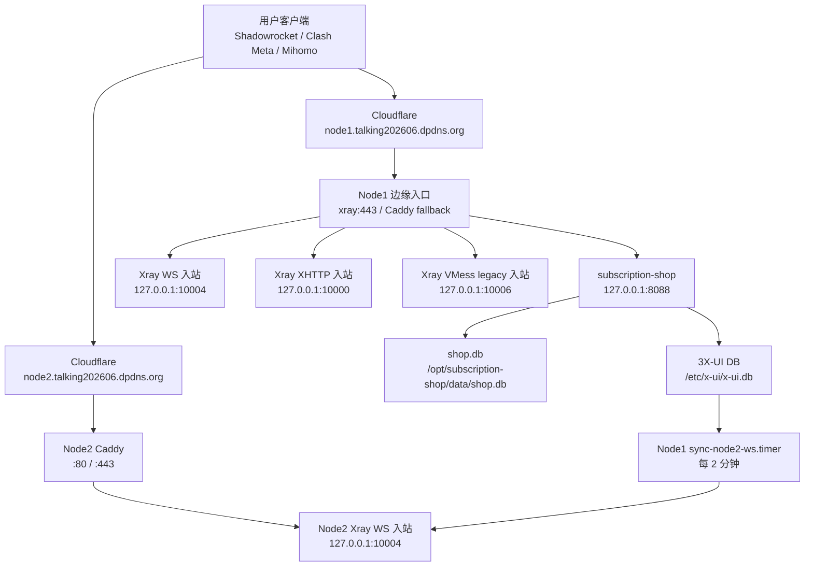

# 燕子站服务构建与维护文档

> 目标读者：接手维护本服务的智能体或工程师。
> 当前快照时间：2026-07-02。
> 本文记录系统结构、现网节点、订阅生成逻辑、客户端兼容策略、部署同步和常用排障流程。不要在本文写入 3X-UI 密码、用户 UUID、订阅 token、私钥或支付密钥。

## 1. 服务概览

燕子站是一个小型代理订阅服务，当前由一个中心站点和两个代理节点组成：

- `Node1 / 美国`：中心订阅服务、商城后台、3X-UI/Xray 主节点。
- `Node2 / 东京`：AWS Lightsail 上的纯代理节点，只运行 Caddy + Xray，不运行商城和支付后台。

现网核心域名：

| 用途 | 域名 |
|---|---|
| 用户站、订阅站、美国节点 | `node1.talking202606.dpdns.org` |
| 东京节点 | `node2.talking202606.dpdns.org` |

当前推荐客户端入口：

| 客户端 | 推荐订阅 URL |
|---|---|
| Clash Meta / Mihomo / Android | `https://node1.talking202606.dpdns.org/clashx/<token>` |
| Shadowrocket / iOS | `https://node1.talking202606.dpdns.org/sub/<token>` |
| 旧 Clash 兼容 | `https://node1.talking202606.dpdns.org/clash-legacy/<token>` |

历史兼容入口：

- `/clash-plain/<token>` 仍保留，但现在已经改为输出和 `/clashx/<token>` 等价的多节点 Clash YAML，用于让已导入旧 URL 的客户端刷新即可看到新节点。

## 2. 当前架构



关键设计：

- 用户、订单、设备绑定、订阅 token、套餐流量都只在 Node1 管理。
- Node2 不保存商城数据库，也不接支付回调。
- Node2 的 Xray 客户端列表由 Node1 从 3X-UI WS 入站导出并通过 SSH 同步。
- 当前对新用户默认发放 WS 兼容链路，避免 XHTTP 在部分手机端不稳定的问题。

## 3. 现网主机

### Node1 / 美国中心节点

| 项 | 值 |
|---|---|
| 主机 | `66.94.122.149` |
| SSH | `ssh -i ~/.ssh/node1_vnc_ed25519 root@66.94.122.149` |
| 生产域名 | `node1.talking202606.dpdns.org` |
| 订阅服务 | `subscription-shop` |
| 管理后台 | `subscription-shop-admin` / `admin.talking202606.dpdns.org` |
| 3X-UI/Xray | `x-ui` |
| 订阅服务代码 | `/opt/subscription-shop/app.py` |
| 订阅服务环境变量 | `/etc/subscription-shop.env` |
| 管理后台环境变量 | `/etc/subscription-shop-admin.env` |
| 业务数据库 | `/opt/subscription-shop/data/shop.db` |
| 3X-UI 数据库 | `/etc/x-ui/x-ui.db` |

服务检查：

```bash
ssh -i ~/.ssh/node1_vnc_ed25519 root@66.94.122.149
systemctl is-active subscription-shop subscription-shop-admin x-ui sync-node2-ws.timer
```

### Node2 / 东京代理节点

| 项 | 值 |
|---|---|
| Lightsail 实例 | `asia-tokyo-node-1-1gb` |
| 公网 IPv4 | `57.181.216.192` |
| 区域 | `ap-northeast-1a` |
| 域名 | `node2.talking202606.dpdns.org` |
| SSH 用户 | `ubuntu` |
| SSH key | `LightsailDefaultKey-ap-northeast-1.pem` |
| 服务 | `caddy`, `xray` |
| Xray 配置 | `/usr/local/etc/xray/config.json` |
| Caddy 配置 | `/etc/caddy/Caddyfile` |

服务检查：

```bash
chmod 600 LightsailDefaultKey-ap-northeast-1.pem
ssh -i LightsailDefaultKey-ap-northeast-1.pem ubuntu@57.181.216.192
systemctl is-active caddy xray
ss -tlnp | grep -E ':(80|443|10004) '
```

当前 Node2 只应暴露：

- `80/TCP`
- `443/TCP`
- `22/TCP`

Xray WS 入站只监听本地：

```text
127.0.0.1:10004
```

## 4. DNS 和 Cloudflare

当前 DNS 预期：

| 记录 | 类型 | 内容 | 代理 |
|---|---|---|---|
| `node1.talking202606.dpdns.org` | A | `66.94.122.149` | 橙云 |
| `node2.talking202606.dpdns.org` | A | `57.181.216.192` | 橙云 |

注意：

- 不要把东京 IP 加到 `node1` 的 A 记录上。
- Node1 和 Node2 应该是两个不同主机名。
- 通过 Cloudflare 后，本地 `dig +short` 可能返回 Cloudflare 边缘地址，不会直接返回源站 IP，这是正常现象。

基本验证：

```bash
dig +short node1.talking202606.dpdns.org A
dig +short node2.talking202606.dpdns.org A
curl -I https://node1.talking202606.dpdns.org/
curl -I https://node2.talking202606.dpdns.org/
```

## 5. Node1 入站和协议策略

当前 3X-UI 关键入站：

| id | 备注 | 监听 | 用途 |
|---|---|---|---|
| `1` | `VLESS-XHTTP-TLS-CF` | `127.0.0.1:10000` | 早期主 XHTTP 入站，保留 |
| `2` | `VLESS-node1-direct-REALITY` | `0.0.0.0:443` | 旧 REALITY 兼容，过渡保留 |
| `3` | `VLESS-XHTTP-TLS-CF-STREAM-UP` | `127.0.0.1:10003` | XHTTP 兼容旁路，保留 |
| `4` | `VLESS-WS-TLS-CF-JACK` | `127.0.0.1:10004` | 当前默认 WS 入站 |
| `5` | `VMESS-WS-TLS-CF-LEGACY` | `127.0.0.1:10006` | 旧 Clash 兼容 |

现网默认策略：

- `NODE_WS_ALL=1`
- `XUI_WS_INBOUND_ID=4`
- 所有非 Reality 订阅默认输出 WS。
- `/sub`、`/clashx`、`/clash-plain` 都应能看到美国和东京。
- `/clash-legacy` 保持 VMess 单节点兼容旧 Clash。

关键环境变量：

```env
PUBLIC_SUB_BASE=https://node1.talking202606.dpdns.org
NODE_CONNECT_HOST=node1.talking202606.dpdns.org
NODE_TRANSPORT=xhttp
NODE_WS_PATH=/c8df789a6f3a4a558632d1bd98b2e923
NODE_WS_HOST=node1.talking202606.dpdns.org
NODE_WS_ALL=1
XUI_WS_INBOUND_ID=4
NODE_EXTRA_WS_NODES=东京|node2.talking202606.dpdns.org|/c8df789a6f3a4a558632d1bd98b2e923
XUI_LEGACY_VM_INBOUND_ID=5
NODE_LEGACY_VM_PATH=/b7d1e6a9c24f4a7fa1d3b85e9c0f62ad
NODE_LEGACY_VM_HOST=node1.talking202606.dpdns.org
```

`NODE_EXTRA_WS_NODES` 格式：

```text
显示名|连接域名|WS路径
```

多个额外节点用英文逗号分隔。例：

```env
NODE_EXTRA_WS_NODES=东京|node2.talking202606.dpdns.org|/c8df789a6f3a4a558632d1bd98b2e923
```

## 6. 订阅输出逻辑

### `/sub/<token>`

用途：Shadowrocket / iOS。

当前输出：base64 编码后的多行 VLESS URI。

验证：

```bash
curl -sS https://node1.talking202606.dpdns.org/sub/<token> | base64 -d
```

期望能看到：

```text
vless://...@node1.talking202606.dpdns.org:443?...#美国
vless://...@node2.talking202606.dpdns.org:443?...#东京
```

### `/clashx/<token>`

用途：Clash Meta / Mihomo / Android。

当前输出：YAML，包含两个 `proxies`：

- `美国`
- `东京`

验证：

```bash
curl -sS https://node1.talking202606.dpdns.org/clashx/<token> | sed -n '1,100p'
```

### `/clash-plain/<token>`

用途：历史兼容入口。

当前行为：为了让旧客户端“刷新即可更新”，它现在也输出和 `/clashx` 等价的多节点 YAML。

不要再把新用户的 `clash_url` 指到 `/clash-plain`。

### `/clash-legacy/<token>`

用途：旧 Clash 内核不支持 VLESS 时使用。

当前输出：VMess WS TLS 单节点。

这个入口不用于新增多节点默认订阅。

## 7. 订单、设备和用户同步

业务数据库：

```bash
sqlite3 /opt/subscription-shop/data/shop.db
```

关键表：

| 表 | 作用 |
|---|---|
| `users` | 用户 |
| `orders` | 订单 |
| `subscriptions` | 主订阅 |
| `subscription_devices` | 设备专用 token |
| `products` | 套餐 |
| `payment_settings` | 支付设置 |

现有订阅 URL 应为：

```sql
select id,email_label,sub_id,clash_url,universal_url,revoked_at
from subscriptions
order by id;
```

当前要求：

- `clash_url` 指向 `/clashx/<sub_id>`。
- `universal_url` 指向 `/sub/<sub_id>`。
- 已撤销订阅通过 `revoked_at != 0` 判断。

设备订阅：

- 设备 token 在 `subscription_devices.token`。
- 设备专用 Clash URL 应为 `/clashx/<device_token>`。
- 设备专用 Shadowrocket URL 应为 `/sub/<device_token>`。

## 8. Node2 客户端同步

Node2 的客户端列表由 Node1 自动同步。

同步脚本：

```text
/usr/local/sbin/sync-node2-ws.py
```

systemd：

```text
/etc/systemd/system/sync-node2-ws.service
/etc/systemd/system/sync-node2-ws.timer
```

当前 timer：每 2 分钟执行一次。

检查：

```bash
systemctl is-active sync-node2-ws.timer
systemctl list-timers sync-node2-ws.timer --no-pager
journalctl -u sync-node2-ws.service -n 50 --no-pager
```

手动同步：

```bash
/usr/local/sbin/sync-node2-ws.py
```

同步逻辑：

1. 从 Node1 `/etc/x-ui/x-ui.db` 读取入站 `id=4` 的 `settings.clients`。
2. 生成 Node2 `/usr/local/etc/xray/config.json`。
3. 通过 SSH/SCP 上传到 `ubuntu@57.181.216.192`。
4. 在 Node2 重启 `xray`。

验证 Node2 客户端数量：

```bash
ssh -i LightsailDefaultKey-ap-northeast-1.pem ubuntu@57.181.216.192
python3 - <<'PY'
import json
c=json.load(open("/usr/local/etc/xray/config.json"))
print(len(c["inbounds"][0]["settings"]["clients"]))
print(c["inbounds"][0]["streamSettings"]["wsSettings"])
PY
```

## 9. 端到端验证

### Node1 服务

```bash
ssh -i ~/.ssh/node1_vnc_ed25519 root@66.94.122.149
systemctl is-active subscription-shop x-ui sync-node2-ws.timer
```

### Node2 服务

```bash
ssh -i LightsailDefaultKey-ap-northeast-1.pem ubuntu@57.181.216.192
systemctl is-active caddy xray
ss -tlnp | grep -E ':(80|443|10004) '
```

### HTTP / TLS

```bash
curl -I https://node1.talking202606.dpdns.org/
curl -I https://node2.talking202606.dpdns.org/
```

### Node2 WebSocket 握手

```bash
curl --http1.1 -i -N \
  -H 'Connection: Upgrade' \
  -H 'Upgrade: websocket' \
  -H 'Sec-WebSocket-Version: 13' \
  -H 'Sec-WebSocket-Key: dGhlIHNhbXBsZSBub25jZQ==' \
  https://node2.talking202606.dpdns.org/c8df789a6f3a4a558632d1bd98b2e923
```

期望看到：

```text
HTTP/1.1 101 Switching Protocols
```

该 curl 会在握手后等待数据并最终超时，超时不是失败；关键是前面已经返回 `101`。

### 订阅内容

替换 `<token>` 为真实订阅或设备 token：

```bash
curl -sS https://node1.talking202606.dpdns.org/sub/<token> | base64 -d
curl -sS https://node1.talking202606.dpdns.org/clashx/<token> | sed -n '1,120p'
curl -sS https://node1.talking202606.dpdns.org/clash-plain/<token> | sed -n '1,120p'
```

期望：

- `/sub` 解码后有两行 `vless://`。
- `/clashx` 有 `美国` 和 `东京` 两个 proxy。
- `/clash-plain` 也有 `美国` 和 `东京` 两个 proxy。

## 10. 客户端行为说明

理想目标：用户刷新订阅即可看到最新节点。

当前实现：

- Android Clash Meta 如果使用 `/clashx` 或旧 `/clash-plain`，刷新应看到东京。
- iOS Shadowrocket 如果使用 `/sub` 作为订阅 URL，刷新应看到东京。
- 如果 Shadowrocket 中保存的是“本地单节点”，不是订阅 URL，则刷新不会拉取远程配置。这类本地节点只能删除后重新添加订阅 URL。之后再新增节点即可通过刷新更新。

维护时不要只验证网页按钮，要直接验证客户端实际保存的 URL：

- Clash/Mihomo 配置里看 `url`。
- Shadowrocket 里看配置类型是否为订阅。

## 11. 添加第三个节点的流程

1. 准备新 VPS，开放 `22/80/443`。
2. 在 Cloudflare 新增 `node3.<domain>`，开启橙云。
3. 在新 VPS 部署 Caddy + Xray，WS 入站监听 `127.0.0.1:10004`。
4. WS path 建议复用现网路径，或者使用新 path 后同步更新环境变量和同步脚本。
5. 在 Node1 增加同步脚本或扩展 `sync-node2-ws.py` 支持多目标。
6. 在 `/etc/subscription-shop.env` 扩展：

```env
NODE_EXTRA_WS_NODES=东京|node2.talking202606.dpdns.org|/path,新节点名|node3.example.com|/path
```

7. 重启订阅服务：

```bash
python3 -m py_compile /opt/subscription-shop/app.py
systemctl restart subscription-shop
```

8. 验证 `/sub`、`/clashx`、`/clash-plain` 都出现新节点。

## 12. 修改生产代码的安全流程

修改 `/opt/subscription-shop/app.py` 前必须备份：

```bash
ts=$(date +%Y%m%d-%H%M%S)
cp /opt/subscription-shop/app.py /opt/subscription-shop/app.py.bak-$ts
cp /etc/subscription-shop.env /etc/subscription-shop.env.bak-$ts
cp /opt/subscription-shop/data/shop.db /opt/subscription-shop/data/shop.db.bak-$ts
cp /etc/x-ui/x-ui.db /etc/x-ui/x-ui.db.bak-$ts
```

发布前检查：

```bash
python3 -m py_compile /opt/subscription-shop/app.py
```

发布后：

```bash
systemctl restart subscription-shop
systemctl is-active subscription-shop
journalctl -u subscription-shop -n 50 --no-pager
```

改 3X-UI 入站或客户端后：

```bash
systemctl restart x-ui
systemctl is-active x-ui
```

## 13. 常见故障

### 刷新订阅后看不到东京

按顺序查：

```bash
curl -sS https://node1.talking202606.dpdns.org/sub/<token> | base64 -d
curl -sS https://node1.talking202606.dpdns.org/clashx/<token> | grep -E '美国|东京|node2'
curl -sS https://node1.talking202606.dpdns.org/clash-plain/<token> | grep -E '美国|东京|node2'
```

如果服务端都有东京，但客户端没有：

- 客户端保存的可能是本地单节点，不是订阅 URL。
- 客户端可能订阅了 `/clash-legacy`，该入口是 VMess 单节点兼容。
- 客户端可能缓存异常，需删除本地配置后重新添加订阅 URL。

### 东京节点显示但连不上

查 Node2：

```bash
systemctl is-active caddy xray
curl -I https://node2.talking202606.dpdns.org/
```

查 WS 握手：

```bash
curl --http1.1 -i -N \
  -H 'Connection: Upgrade' \
  -H 'Upgrade: websocket' \
  -H 'Sec-WebSocket-Version: 13' \
  -H 'Sec-WebSocket-Key: dGhlIHNhbXBsZSBub25jZQ==' \
  https://node2.talking202606.dpdns.org/c8df789a6f3a4a558632d1bd98b2e923
```

如果没有 `101`：

- 检查 Cloudflare DNS 是否指向 Node2。
- 检查 Lightsail 防火墙是否放行 `443`。
- 检查 Caddy 是否 active。
- 检查 `/etc/caddy/Caddyfile` 中 path 是否和订阅一致。

### 新用户开通后东京没有权限

查同步：

```bash
systemctl list-timers sync-node2-ws.timer --no-pager
journalctl -u sync-node2-ws.service -n 50 --no-pager
/usr/local/sbin/sync-node2-ws.py
```

查 Node2 配置客户端数量：

```bash
ssh -i LightsailDefaultKey-ap-northeast-1.pem ubuntu@57.181.216.192
python3 - <<'PY'
import json
c=json.load(open("/usr/local/etc/xray/config.json"))
print(len(c["inbounds"][0]["settings"]["clients"]))
PY
```

### Clash 报不支持 VLESS

旧 Clash 内核不支持 `type: vless`。让用户使用：

```text
/clash-legacy/<token>
```

但这是旧兼容入口，不会默认多节点。

## 14. 流量和预算

Node2 当前为 AWS Lightsail 东京 1GB 套餐：

- 约 `1GB RAM`
- `40GB SSD`
- `2TB transfer/month`

注意：

- Lightsail transfer 统计包括入站和出站。
- 代理场景中，用户下载通常会造成 VPS 先入站再出站，因此 2TB transfer 不等于 2TB 用户下载量。
- 粗略估算，用户实际下载容量可按约 1TB 级别保守看待。
- 系统网卡计数只表示本次开机以来流量，不等于 AWS 账单月统计。

查看 Node2 系统网卡计数：

```bash
awk 'NR<=2 || /ens5/' /proc/net/dev
```

月度费用和超额流量必须以 AWS Lightsail Metrics/Billing 为准。

## 15. 当前已知维护原则

- 不要把 Node2 当成第二套商城部署；它只是纯代理节点。
- 不要直接手改订阅文本绕过后端逻辑；应改 `app.py` 的生成函数和环境变量。
- 不要只改 3X-UI `inbounds.settings.clients`；新版 3X-UI 还涉及 `client_inbounds`，现有开通逻辑已经处理。
- 新增节点后必须同时验证 `/sub`、`/clashx`、`/clash-plain`，否则旧客户端刷新可能看不到。
- 对生产文件操作前先备份。
- 订阅 token、UUID、支付密钥、Cloudflare token、SSH 私钥不要写入文档或聊天。
